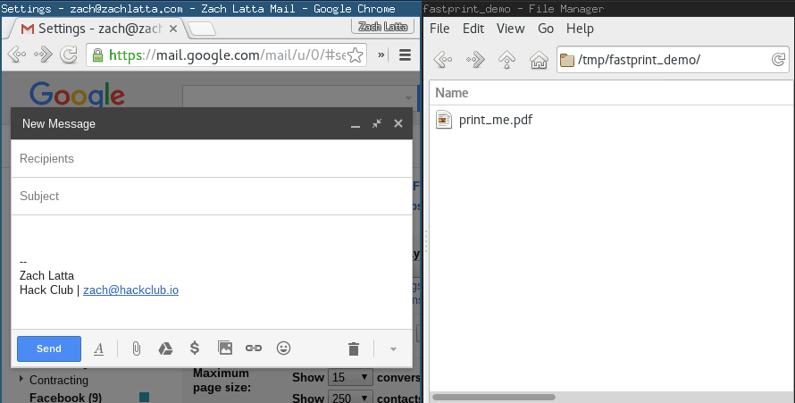

# Fastprint

Email a file to `print@yourdomain.com` to print it.

Demo:

## Setup

There are three steps to get Fastprint working:

1. [Set up an OS X or Linux machine with a printer (Fastprint will run on this
   machine)](#machine-setup)
2. [Configure a Mailgun account to handle mail sent to
   `print@yourdomain.com`](#mailgun-setup)
3. [Start Fastprint](#start-fastprint)

#### Machine Setup

Start by configuring your computer with the printer you'd like to use, if it's
not set up already. If you're on OS X or a large Linux distro (like Debian),
you'll want to use your standard system preferences for setting this up.

#### Mailgun Setup

Next create a [Mailgun](https://mailgun.com) account and set it up with your
domain of choice. I've configured mine with `mg.zachlatta.com`.

Once you've done that, run the following command, replacing
`YOUR_API_KEY`,`YOUR_DOMAIN_NAME`, and `FASTPRINT_URL` with appropriate values
from the Mailgun dashboard (ex. `key-c0c122841822ef7681bf191cd0090f14`,
`mg.zachlatta.com`, and `https://fastprint.apps.zachlatta.com`, respectively).
This tells Mailgun to send any emails received at `print@yourdomain.com` to
Fastprint to process. `FASTPRINT_URL` is the URL to your hosted Fastprint
instance. You can use https://ngrok.com/ to expose an instance of Fastprint
running in your local network to the world.

    $ curl -s --user 'api:YOUR_API_KEY' \
        https://api.mailgun.net/v3/routes \
        -F priority=0 \
        -F description='Fastprint' \
        -F expression='match_recipient("print@YOUR_DOMAIN_NAME")' \
        -F action='forward("FASTPRINT_URL/receive")' \
        -F action='stop()'

#### Start Fastprint

The final step is to start Fastprint itself. Go ahead and clone Fastprint,
install dependencies, and then run `npm start`.

    $ git clone https://github.com/zachlatta/fastprint
    $ npm install
    $ npm start

It'll error on the first run and complain about `PRINTER_NAME` not being set.
It'll print a list of the available printer names. Set `PRINTER_NAME` to one of
those printer names and then run `npm start` again. After that, you should be
good to go!

## License

Fastprint is licensed under the MIT license. See [LICENSE](LICENSE) for the full
license.
